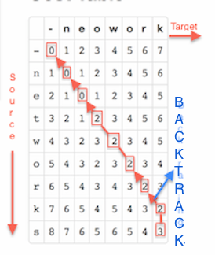

---
title       : Substring Match
subtitle    : Edit Distance (Levenstein)
author      : Mridul Jain   
job         : Software
framework   : io2012        # {io2012, html5slides, shower, dzslides, ...}
highlighter : highlight.js  # {highlight.js, prettify, highlight}
hitheme     : tomorrow      # 
widgets     :  [bootstrap, quiz, shiny, interactive]         # {mathjax, quiz, bootstrap}
mode        : selfcontained # {standalone, draft}
knit        : slidify::knit2slides
---#custbg
<style>.title-slide {background-color: #EDE0CF; /*#CA9F9D*/}</style>
<style>.title-slide {font-family: 'Helvetica', sanserif;}</style>
<style>.title-slide hgroup > h2 {color:  #EF5150;}</style>
<style>#custbg {background-color: #EDE0CF; /*#CA9F9D*/}</style>
## Introduction

Edit distance is a standard dynamic programming algorithm, which basically:

1. Finds all the substring matches for an input string(target) inside a given (source) string. Eg: Given a source string <span style="color:red">"networks"</span> and a target string <span style="color:red">"neowork"</span>, it matches <span style="color:blue">"ne"</span> and <span style="color:blue">"work"</span> and outputs the one which is longest i.e <span style="color:blue">"work"</span>. 
2. Shows which operations (insert(I),delete(D), substitute(S),no change/match(M)), are required to convert a source string to target string. Eg: <span style="color:blue">"MMSMMMMD"</span> i.e substitute "t" with "o" and delete "s" from source.

### Motivation
It is often easier to understand an algorithm visually. With Shiny's reactive power, it was a no brainer to develop it.
Moreover, it fit into R well owing to the dataframe/grid modelling. 

--- #custbg
<style>#custbg {background-color: #EDE0CF; /*#CA9F9D*/}</style>
## Algorithm
There are 2 major steps in the algorithm:

1. Fill a grid between the source string and target string using the minimum cost function by considering the 3
adjacent cells: upper, left and diagonal(upper left). <span style="color:red">Cost of insertion(I)  or deletion(D) is 1 and cost of substitution(S) is 2</span>. 
2. Backtracking: helps to find the exact cost and sequence of operations required to convert source string to target string. Also helps to track all substring matches, from which we choose the longest match.
<div style='text-align: center;'>
    
</div>

---#custbg
<style>#custbg {background-color: #EDE0CF; /*#CA9F9D*/}</style>
## Inbuilt String Match in R
<style>
pre {
  margin-top: -25px;
  margin-bottom: -25px;
}
</style>
None of functions in R for partial string matching do what Edit Distance does.
```{r }
#Below matches the complete word 'network' with the first of the triplet.
pmatch("network", c("networks", "net", "work"))
#Below is not able to find substring word 'work' in the triplet.
pmatch("neowork", c("networks", "net", "work"))
#Below is able to find substring word 'work' in the triplet.
grep("work","networks")
#Below is not able to find substring word 'work' in the triplet.
grep("neowork","networks")
#Edit distance (on the shiny app) can do the above.
```

---#custbg
<style>#custbg {background-color: #EDE0CF; /*#CA9F9D*/}</style>
## Caveats & Improvements
Given the short time, the algorithm is basic. Note the following:

1. Better substring match algorithms exists. Eg: Boyer Moore is one of the best (though much more comlicated) algorithm for exact substring match. Edit Distance algo fails in cases like: <span style="color:red">source->"networks", target->"netnetworks" by producing "net"</span>
2. Based on the visuals and interactivity, the shiny app can provide better understanding w.r.t why things work or not (like above).
3. More testing is required to figure out edge cases, nevertheless the work done aims to satisfy the basic intent of learning shiny, reactive expressions & slidify than the correctness of the algo.
4. The implementation is <span style="color:red">case sensitive, data types are not checked yet, error shows on the page when strings are blank.</span>
5. The algo is quite fast and it is beautiful to check the impact of changes in target string almost in realtime.
6. I am trying to get the shortest path highlighted, but it may require more work on HTML side. Recheck the page after a week or so.

---#custbg
<style>#custbg {background-color: #EDE0CF; /*#CA9F9D*/}</style>
## Applications 
Searching for patterns in text strings is a problem of unquestionable importance. While algos like Rabin-Karp etc exist for exact string match, words in either text or pattern can be misspelled robbing us of exact similarity.

Evolutionary changes in genomic sequences or language usage imply that we often search for archaic patterns in mind. How can we search for the substring closest to a given pattern to compensate for spelling errors? Edit distance algorithms are basically used in spell correctors and substring match. 


## References
1. Levenstein Edit Distance Algorithm: http://en.wikipedia.org/wiki/Levenshtein_distance
2. This project was inspired by: http://www.let.rug.nl/kleiweg/lev/
3. "The Algorithm Design Manual" by Steve Skiena


